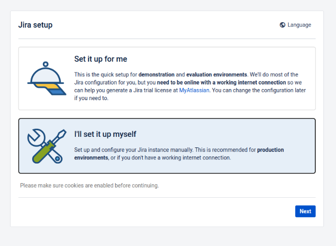
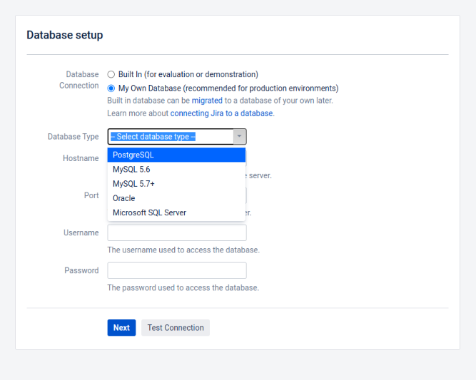
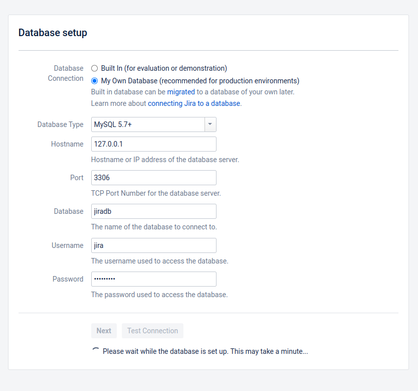
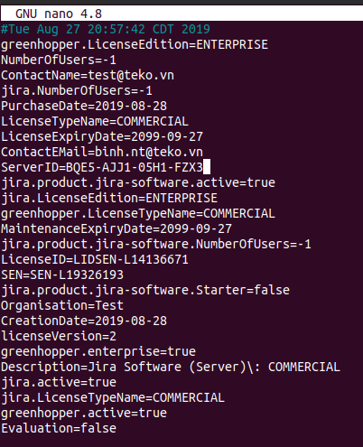
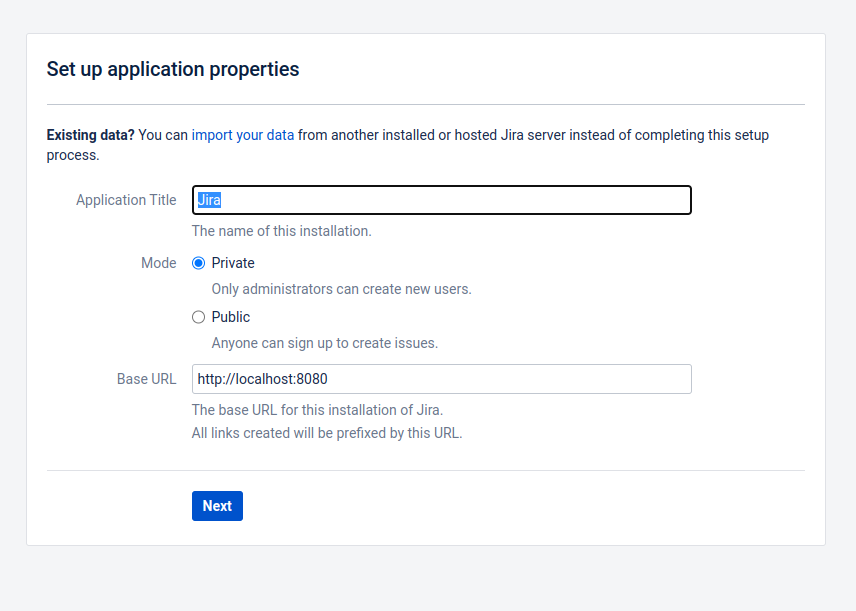
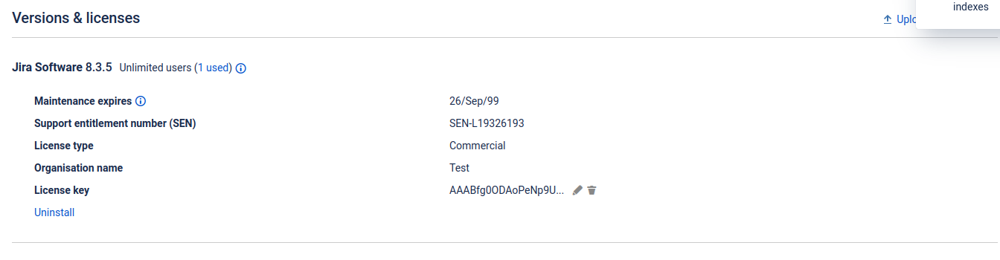

# Cài đặt jira 8.3.5 trên Ubuntu 20.04.6 LTS

## 1. Môi trường cài đặt
- Ubuntu 20.04.6 LTS
- PHP 7.4.3
- MySQL 7.7.41

## 2. Các bước cài đặt
**Giải nén atlassian-jira-software 8.3.5**

```
tar -xzf atlassian-jira-software-8.3.5.tar.gz 
```

**Chọn thư mục cài đặt (/var)**

```
sudo mv atlassian-jira-software-8.3.5-standalone /var
```

**Đổi tên thư mục thành jira-software**

```
sudo mv /var/atlassian-jira-software-8.3.5-standalone /var/jira-software
```

**Tạo thư mục jirasoftware-home để lưu log của service**

```
sudo mkdir /var/jirasoftware-home
```

**Cấp quyền cho thư mục**

```
sudo chmod -R 777 /var/jira-software

sudo chmod -R 777 /var/jira-software
```

**Cấu hình đường dẫn ghi log của ứng dụng**

```
nano /var/jira-software/atlassian-jira/WEB-INF/classes/jira-application.properties 
```

**Tạo cơ sở dữ liệu**

```
CREATE DATABASE jiradb;
```

**Cài đặt JDBC Connector cho service**

```
sudo mv mysql-connector-j-8.0.32.jar /var/jira-software/lib 
```

**Cài đặt plugins cho ứng dụng**

```
sudo cp atlassian-universal-plugin-manager-plugin-4.0.4.jar /var/jirasoftware-home/plugins/installed-plugins
```

**Cài đặt atlassian extras**

```
sudo cp atlassian-extras-3.2.jar /var/jira-software/atlassian-jira/WEB-INF/lib
```

**Chạy jira service**
```
/var/jira-software/bin/start-jira.sh
```

- Setup  
  
  
- Sử dụng MySQL 5.7+
  

- Sinh ra SeverID của ứng dụng
  


**Generate license key**

- Copy server id vào file license_key.txt
  

```
php atlassian-keygen.php -e license_key.txt
```

- Lấy key đã được tạo
    

- Copy key vào console
    


**Chạy ứng dụng và cài đặt admin user**

- Cài đặt
    
    

## 3. Kết quả cài đặt

**Kết quả cài đặt**
    

## 4. Tài liệu tham khảo
https://confluence.atlassian.com/adminjiraserver071/installing-jira-applications-on-linux-from-archive-file-855475657.html